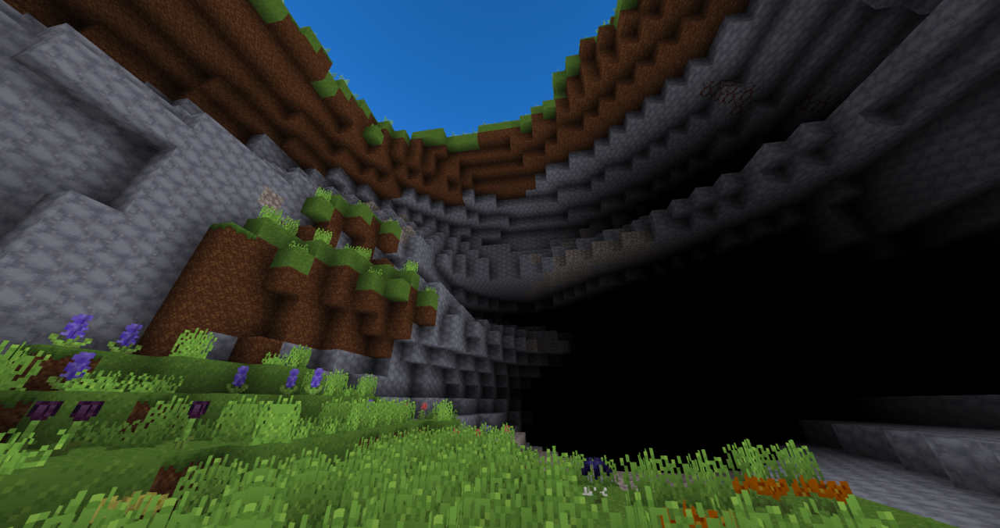
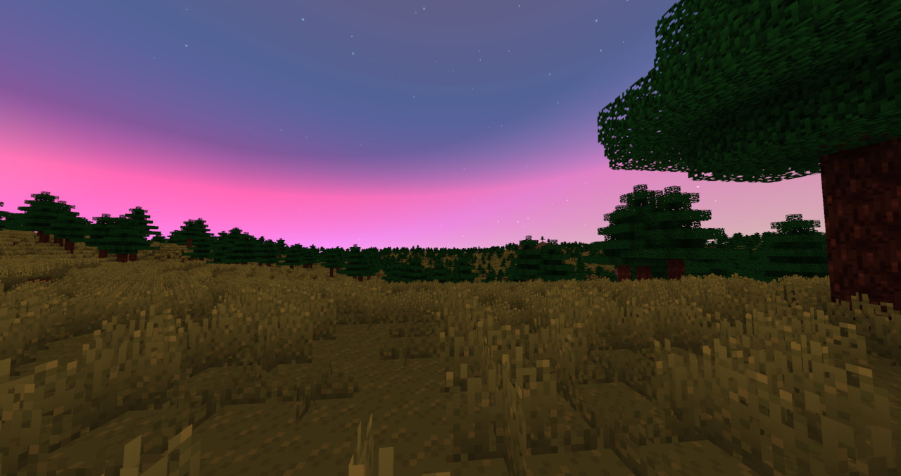
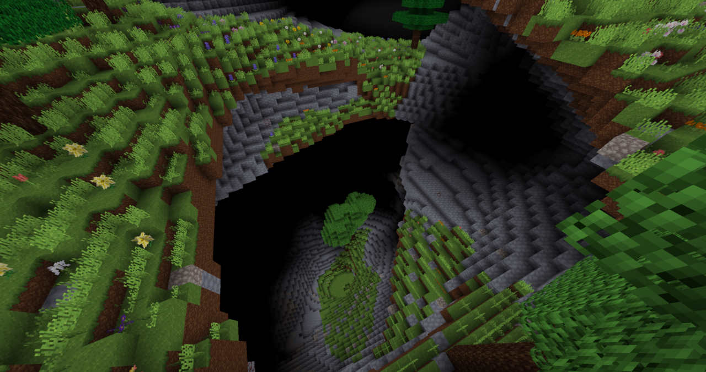
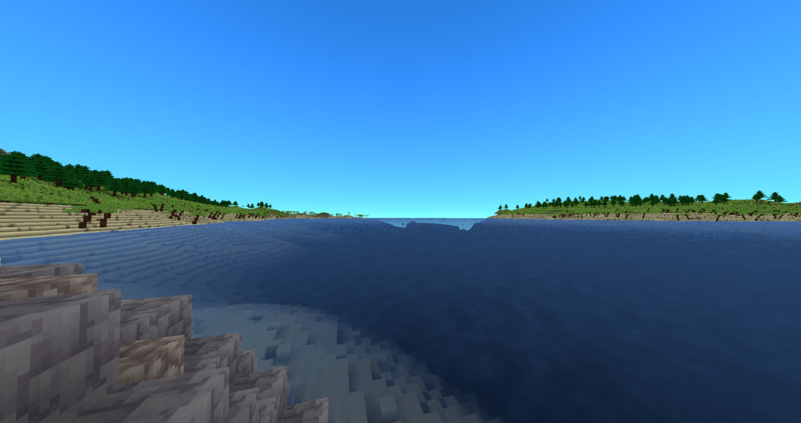
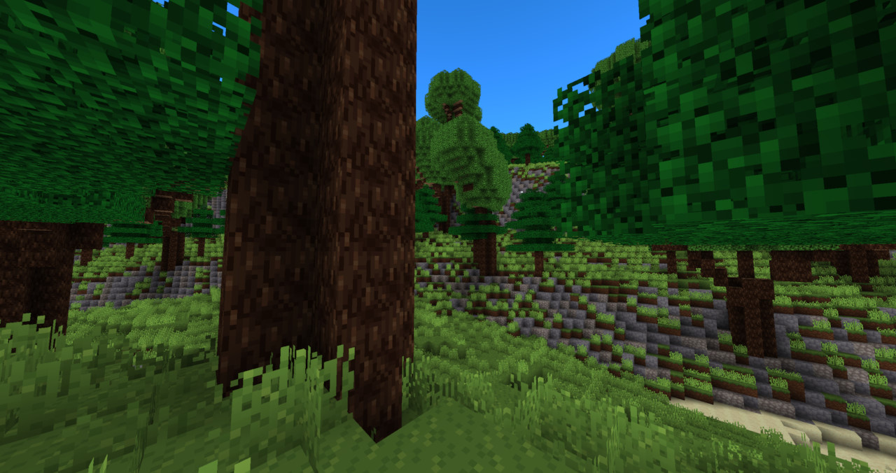
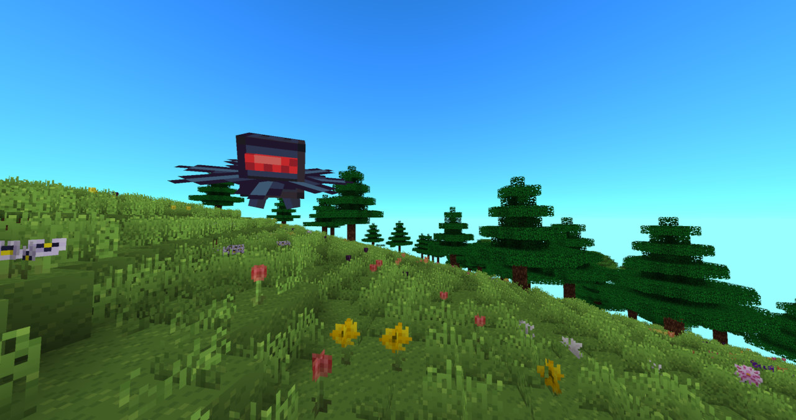

# Cosmic Earth - Terrain Generator
### *A second and reimagined release of the original Cosmic Earth Terrain Generator that never had a release to begin with*

---
This terrain generator aims to both provide **stylized landscapes** using complex noise functions and to give an extensible interface for others to create **new terrain** with as well.

This is a mod for [Cosmic Reach](https://finalforeach.itch.io/cosmic-reach), a game by [FinalForEach](https://www.youtube.com/@finalforeach) (YouTube link), built using the [Puzzle Modloader](https://github.com/PuzzleLoader/).

---

## Credits
* All texture and model assets included in this mod are made by me.

---
### Contributing
* I don't know enough about GitHub yet to handle contributions, but if you would like to show me how easy (or annoying) it is, I should be open to hear.

---
### License
* While the main project is licensed under Apache 2.0, the core com.arlojay.cosmicearth.lib.noise package is licensed under MIT.